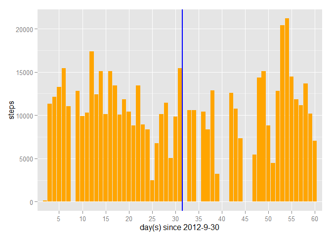
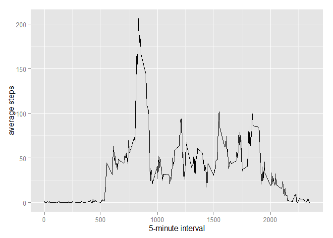
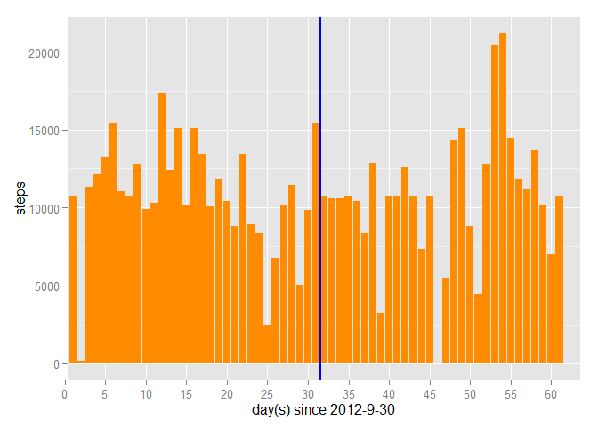
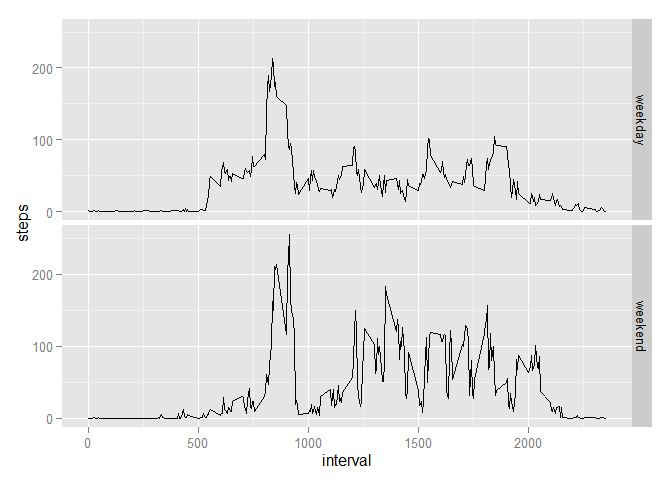

# Reproducible Research: Peer Assessment 1


## Loading and preprocessing the data

```r
library(ggplot2)
library(stringr)
library(knitr)
activity <- read.csv("C:/Users/louis_000/Desktop/Coursera/Reproducible research/RepData_PeerAssessment1/activity.csv")
stepsByday <- aggregate(activity$steps,list(activity$date),sum)
names(stepsByday) <- c("date","steps")
```


## What is mean total number of steps taken per day?

```r
steps_mu <- format(mean(stepsByday$steps,na.rm = T),digits = 9)
steps_median <- median(stepsByday$steps,na.rm = T)
```
**Mean number of steps taken per day is 10766.1887**

**Median number of steps taken per day is 10765**


```r
g <- ggplot(stepsByday[is.na(stepsByday$steps)==F,],aes(as.numeric(date),steps))+geom_bar(stat="identity", fill="orange")+labs(x="day(s) since 2012-9-30")+scale_x_discrete(breaks=seq(0,70,5))
g <- g+geom_vline(xintercept=31.5,lwd=1,col="blue") #separate October and November
g
```

 


## What is the average daily activity pattern?

```r
stepsByTime <- aggregate(activity$steps,list(activity$interval), function(x){mean(x,na.rm=T)})
names(stepsByTime) <- c("5-minute interval","average steps")
g2 <- ggplot(stepsByTime,aes(`5-minute interval`,`average steps`)) +geom_line()
g2
```

 

```r
max <- stepsByTime$`5-minute interval`[stepsByTime$`average steps`==max(stepsByTime$`average steps`)]
```
**The 5-min interval (Time) that contains the max. steps on average across all the days is 835**

## Imputing missing values

```r
c("Total number of rows with NA = ",sum(is.na(activity$steps)==T))
```

```
## [1] "Total number of rows with NA = " "2304"
```
**Some days contains NA record only for all interval, so I would use mean of that interval to fill in missing values**

```r
imputed_activity <- activity
for (i in 1:nrow(imputed_activity)) {
        if (is.na(imputed_activity$steps[i])) {
                imputed_activity$steps[i] <- stepsByTime$`average steps`[stepsByTime$`5-minute interval` == imputed_activity$interval[i]] }
}
```


```r
stepsByday2 <- aggregate(imputed_activity$steps,list(activity$date),sum)
names(stepsByday2) <- c("date","steps")
g3 <- ggplot(stepsByday2,aes(as.numeric(date),steps))+geom_bar(stat="identity", fill="darkorange")+labs(x="day(s) since 2012-9-30")+scale_x_discrete(breaks=seq(0,70,5))
g3 <- g3+geom_vline(xintercept=31.5,lwd=1,col="blue") #separate October and November
g3
```

 

```r
steps_mu <- format(mean(stepsByday2$steps,na.rm = T),digits = 9)
steps_median <- format(median(stepsByday2$steps,na.rm = T),digits=9)
```
**Mean number of steps taken per day is 10766.1887**

**Median number of steps taken per day is 10766.1887**

**We can see there is very little impact on both mean and median**

## Are there differences in activity patterns between weekdays and weekends?


```r
library(dplyr)
```

```
## 
## Attaching package: 'dplyr'
## 
## The following objects are masked from 'package:stats':
## 
##     filter, lag
## 
## The following objects are masked from 'package:base':
## 
##     intersect, setdiff, setequal, union
```

```r
imputed_activity$date<-as.Date(imputed_activity$date)
last <- mutate(imputed_activity,weekday=factor(grepl(c("Saturday","Sunday"),weekdays(date)),labels=c("weekday","weekend")))
byWeekday <- as.data.frame(summarise(group_by(last,interval,weekday),steps=mean(steps,na.rm=T)))
g4 <- ggplot(byWeekday,aes(interval,steps),fill=weekday)+geom_line()+facet_grid(weekday~.)
g4
```

 

